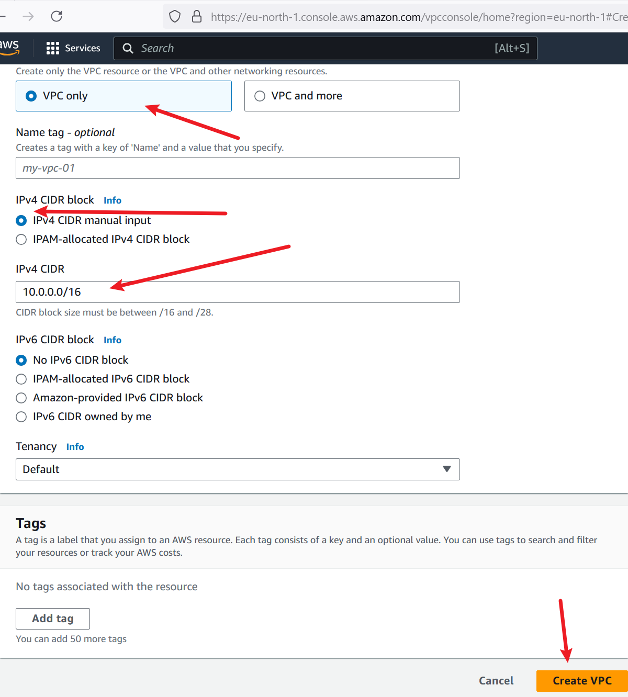
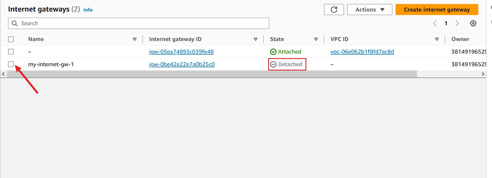
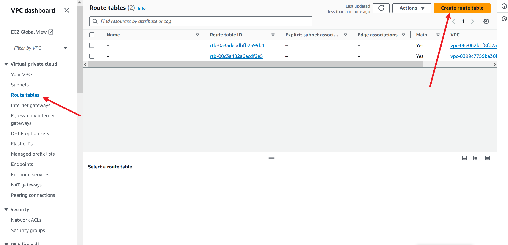

# Network Mastery with AWS VPC mini project.

We will explore the core concept of Amazon Web Services (AWS), focusing specifically on Virtual Private Clouds (VPCs). We will focus on understanding the fundamental components of VPC infrastructure, including subnets, gateways, and routing table.

### *project Goals:*

- Gain expertise in Virtual Private Cloud (VPC) fundamentals and its core components

- Master the setup and configuration of  :
 VPC, subnets, internet gateway, NAT gateway, and VPC peering connections.

- Learn how to enable internet connectivity securely within a VPC.

- Implement outbound internet access through  NAT gateway.

- Establish direct communication between VPCs using VPC peering.

This knowledge will enable you to design and implement secure and efficient network architectures in the cloud.

### *Learning Objective:

- Gained knowledge about VPC and its essential components, such as subnet, gateways, and route tables.

- Enhanced skills in creating and configuring VPC resources using AWS management console.

- Learned how to set up routing tables to enable internet connectivity and outbound internet access securely.

- Acquired understanding of VPC peering and its significance in connecting multiple VPCs within the same or different regions.

- Developed understanding of network security principles and best practices for cloud environments.

###  VPC, Subnets, Internet Gateway and NAT Gateway.

Let's uses a flight scenario to explain these concepts in a simple and relatable way.

VPC (Virtual Private Cloud)

- A VPC is like a private jet (your own secure aircraft).

Subnets

- Subnets are like separate sections within the jet (first class, economy, etc.).

Internet Gateway (IGW)

- The Internet Gateway is like the jet's exit door (entry/exit point to/from the jet).

NAT Gateway (NGW)

- The NAT Gateway is like a flight attendant who handles communication between passengers (inside the jet) and air traffic control (outside the jet), while keeping the passengers' identities private.

### *Note:* 

#### IP Address

- An IP address is a unique numerical label assigned to each device connected to a computer network, allowing communication between devices.

#### Public IP Address

- A Public IP address is an IP address visible to the public internet, allowing devices to be accessed directly from outside a private network.

#### Private IP Address

- A Private IP address is an IP address only visible within a private network (like a home or company network), not directly accessible from the public internet.

#### IPv4 Address

- An IPv4 address is a 32-bit IP address (e.g., 192.0.2.1), which has a limited number of unique addresses (approximately 4.3 billion).

#### IPv6 Address

- An IPv6 address is a 128-bit IP address (e.g., 2001:0db8:85a3:0000:0000:8a2e:0370:7334), providing a much larger pool of unique addresses (almost unlimited).

In summary:

- IP address: unique device identifier
- Public IP: visible to the public internet
- Private IP: only visible within a private network
- IPv4: older, shorter address format (limited availability)
- IPv6: newer, longer address format (much more available)

### *Steps:* 
1. Setting up a virtual Private Cloud (VPC).

2. Configuring Subnets within the VPC.

3. Creating Internet Gateway and attaching it to VPC.

4. Enabling Internet Connectivity with Internet Gateway by setting up Routing tables.

5. Enabling Outbound Internet Access through NAT Gateway .

6. Establishing VPC Peering Connections.

### First Step: Setting up a Virtual Private Cloud (VPC)

1. Navigate to the search bar.

a) Type "VPC", once it pops up, click on it. This will direct you to the Virtual Private Cloud (VPC) page.

2. Click on the "Create VPC" option.

3. Select the "VPC only" option, specify the IPv4 CIDR block, and proceed by clicking the "Create VPC" button.

The VPC has been successfully created.

First step done successfully.

### Second Step: Configuring Subnets within the VPC.

1. Navigate to the "Subnets" option on the left.

a) Once you click on it, you will be directed to the "Subnets" page.

b) Once there, proceed to click on the "Create subnet" button.

2. Select the ID of the VPC that you created in the previous step (First step)

### Note: 
To ensure clarity and consistency in our subnet naming, let's adopt a convention that explicitly distinguishes between public and private subnets. This will help avoid confusion and make it easier to identify and manage our resources. In this case case we can use "Public" and "Private"

3. Now, enter the subnet name, and specify the IPv4 CIDR for the subnet.

a) Choose the availability zone

b) Specify the IPv4 CIDR for the subnet.

c) Click on the "Add subnet" button to create another subnet.

d) Repeat the same steps for the second subnet

e) make sure to specify the subnet name, choose the availability zone, and provide the IPv4 CIDR.

f) Click on the "Create " button to create the subnet.

You will see it has been successfully created.

Second step done successfully.

### Third Step: Creating Internet Gateway and attaching it to VPC.

1. Access the Internet Gateway section by clicking on it in the left sidebar.
a). Once redirected to the Internet Gateway page, click the "Create internet gateway" button to start the creation process.

2. Specify the name of the Internet Gateway.

a) and then click the "Create Internet Gateway" button.

Internet gateway has been successfully created.

Notice that it is detached, indicating that it is not associated with any VPC. To enable internet connectivity, you must attach the internet Gateway to the VPC you have previously created.

Go ahead and attach it to the VPC.

Moving on to the next part which is Enabling Internet Connectivity with the Internet Gateway by setting up Routing tables.

### Fourth Step: Enabling Internet Connectivity with the Internet Gateway by setting up Routing tables.

1. Access the "Route Tables" section by clicking on it in the left sidebar.

a) Once there, click on the "Create route table" button.

2. Specify the name of the route table and select the VPC you previously created.

a) Then, click on the the "Create route table" button to continue.

b) Next, click on "Subnet associations", followed by "Edit subnet associations" to associate the subnet with this route table, We'll associate the public subnet with this route table.

3. Choose the public subnet and click on save association.

4. Navigate to "Routes" and then click on "Edit routes"

5. Click add route.

6. Select "Destination" as "0.0.0.0/0," indicating that every IPv4 address can access this subnet.

7. For the "Target" field, choose "Internet Gateway," and then select the internet Gateway you created.Then save the changes.

The route table has now been configured to route traffic to the Internet Gateway, allowing connectivity to the Internet. Since only the public subnet is associated with this route table, only resources within that subnet can access the internet.

Moving on to the next part of the project which Enabling Outbound Internet Access through NAT Gateway, (by attaching NAT Gateway to the subnet and attaching the route table)

### Part five: Enabling Outbound Internet Access through NAT Gateway.

1. Navigate to the "NAT Gateways" section,then click on "Create NAT Gateway."

2. Specify the name of the NAT Gateway.

3. Now, choose the private subnet, select the connectivity type as 'Private", then click on create "NAT Gateway.

Your NAT Gateway has been successfully created.

6. Select your NAT Gateway.

7. Navigate to the "Details" tab.

8. From there, locate the subnet ID and click on it.

9. In the subnet page, navigate to the "Route Table" section.

10. Click on the "route table ID"- in this case - rtb-00c3a482a6ecdf2e5

11. Proceed to the "Routes" section, then click on "Edit routes."

12.Proceed to click on "Add routes".

a) Select "Destination" as "0.0.0.0/0."

b) In the "Target" field,choose "NAT Gateway,"

c) Then select the NAT Gateway you created.

d) Finally, click on "save changes" to save.

13.Click on  the subnet association section,then  click on edit subnet association.

a) Choose the private subnet and click on "Save associations"

Subnet has been successfully attached with the route table.

Difference between Internet Gateway and Nat Gateway.

#### Internet Gateway (IGW) 

Internet Gateway connects a VPC to the internet, allowing all instances to access the internet directly. Its like a door to the internet for your subnet. When you attach an Internet Gateway to a subnet, it allows the resources in that subnet(like EC2 instances) to reach out to the internet and also allows the internet traffic to reach those resources. Its like having a door both to enter and exit the subnet.

#### Nat Gateway:

NAT Gateway (NGW) allows instances in private subnets to access the internet while keeping their private IP addresses hidden, providing an additional layer of security.
It's a one-way street sign for your subnets's traffic. When you attach a NAT Gateway to a subnet, it lets the resources in that subnet (like EC2 instances) access the internet, but it does not allow incoming traffic from the internet to reach those resources.

#### Note: 

 An EC2 instance is a virtual server in AWS that you can use to run your own applications, store data, and connect to the internet. EC2 instances are widely used for hosting websites, running software, and processing data in the cloud.

 #### What is VPC Peering:

 VPC Peering is a networking connection between two Virtual Private Clouds (VPCs) that allows them to communicate with each other as if they were in the same network.

 - EC2 instances in different VPCs cannot communicate with each other by default. 
 - Communication can be possible by setting up VPC peering, VPN Connections, or AWS Direct Connect.

 - VPC peering establishes a direct network connection between the VPCs, allowing EC2 instances in one VPC to communicate with EC2 instances in the other VPC.

 ### Part Six: Establishing VPC Peering Connections.

 1. Lets begin by creating two VPCs in the same region.
 Alternatively, you may choose a different region if needed.

  

  

   

   The second one

   

   

   2. Navigate to the "Peering Connections" option on the left side.

   a) Once you click on it, you will be directed to the VPC peering page.

   b) from there, proceed to click on the "Create Peering Connection" button.

   

   3. Provide a name for the VPC peering connection.

   a) Select the requester VPC.

   b) Choose the account "My account" since the VPCs are in our own AWS account.

   c) Ensure to use the same region, "This Region ()," as the VPCs were created in the same region.

   d) Next, select the accepter VPC

   e) proceed by clicking on the "Create Peering Connection" button.

   

   

   The next thing you will see is this.

   

   4. In the peering Connection page , locate the "Actions" option on the right side.

   a) Click on it, then select "Accept Request."

   

   b) Click on Accept request.

   

   

   5. Click on Main route table ID of the accepter VPC.

   

   6. Choose the route table.

   a) then navigate to the "Routes" section.

   b) Click on "Edit route"

   

   c) Click on add route

   

   7. Navigate to the VPC page

   a) select the requester VPC.

   b) In the details tab, you'll find the IPv4 CIDR. (in this case- 192.168.0.0/16)

   c) Copy the CIDR and paste it in the "Destination" field when adding a route.

   

   d) In the target, choose VPC peering and then choose the peering connection you created. Click on "save changes".

   

   8. Now,copy the IPv4 CIDR of the accepter VPC. (in this case- 172.16.0.0/16)

   

   9. Click on the main route table of the requester VPC.

   

   10. Choose the route table, then navigate to the "Routes" section. Click on "Edit route"

   

   11. Click on add route.

   a) Paste the CIDR in the "Destination" field.

   b) In the target, choose VPC peering.

   c) Then choose the peering connection you have created.

   

   Congratulations! The connection has been successfully established. Now, resources in the accepter VPC can connect to resources in the requester VPC.

Thank you.
   

    
    

    

    

    

 

